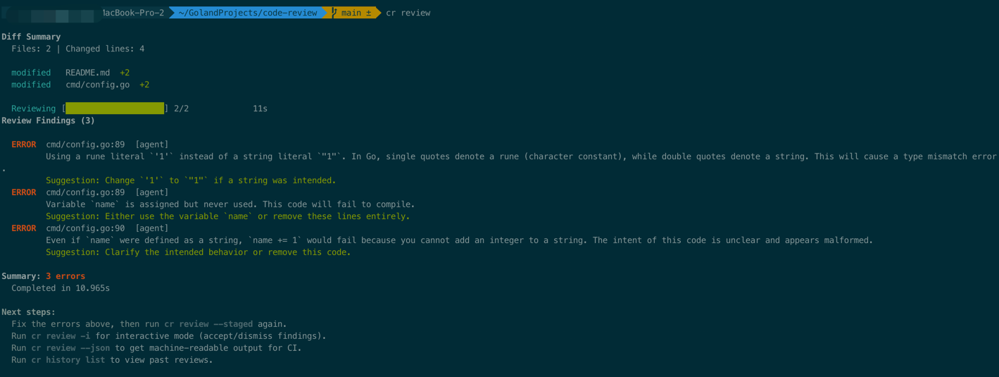
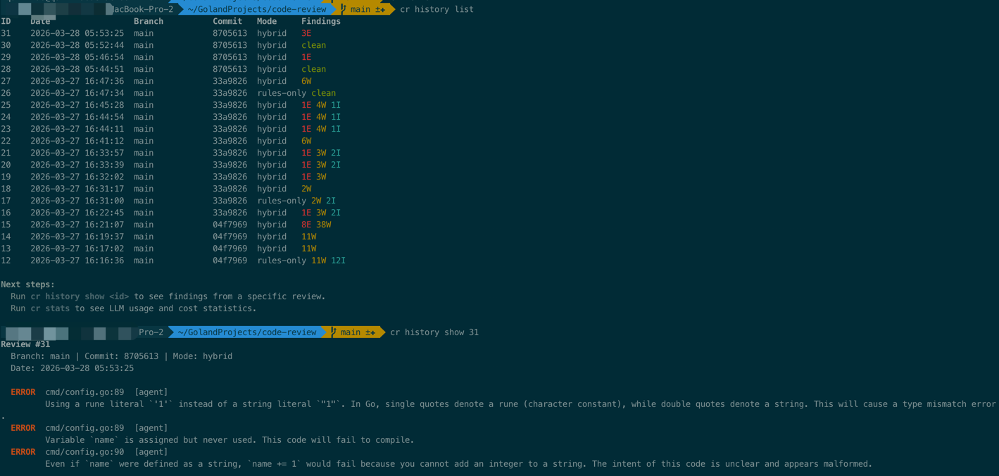

# cr — Code Review CLI

A terminal-based code review tool that combines **deterministic rule-based analysis** with **LLM-powered agent review**. It analyzes local git diffs, applies configurable rules (YAML or JSON), and optionally sends code to an AI agent for deeper review.

## Features

- **Hybrid review** — rule engine + AI agent working together
- **19 built-in rules** for Go, Python, JavaScript/TypeScript, SQL, and security
- **Custom rules** in YAML or JSON with glob file matching and regex patterns
- **Interactive TUI** — navigate findings, accept/dismiss/fix inline, AI chat mode for continuous conversation
- **Git hooks** — pre-commit and pre-push hooks with auto-install
- **PRD-aware review** — feed product requirements to the agent for context
- **Noise reduction** — severity filtering, deduplication, grouping, confidence thresholds
- **LLM caching** — avoid re-reviewing identical diffs
- **Cost tracking** — monitor token usage and estimated spend
- **Review history** — SQLite-backed history with recall
- **Flexible targeting** — staged changes, branch compare, commit ranges, path scoping





## Install

### npm (recommended)

```bash
npm install -g @kizuhiko/cr --registry https://registry.npmjs.org
```

### Build from source

```bash
git clone https://github.com/qzhello/code-review.git
cd code-review
make build
# Binary: ./cr
```

Requires Go 1.25+ and CGO_ENABLED=1 (for SQLite).

## Quick Start

```bash
# Initialize config in your project
cd your-project
cr init

# Review staged changes (rules only — works offline)
cr review --staged --mode rules-only

# Review with AI agent (requires OPENAI_API_KEY)
export OPENAI_API_KEY=sk-...
cr review --staged

# Interactive TUI mode
cr review --staged -i
```

## Usage

### Review Commands

```bash
# Review targets
cr review                          # all uncommitted changes
cr review --staged                 # staged changes only
cr review --branch main            # compare to branch
cr review --commit HEAD~3          # last 3 commits
cr review --commit v1.0..v2.0      # between tags

# Path scoping
cr review ./src/                   # changes in src/ only
cr review --staged cmd/ internal/  # multiple paths

# Review modes
cr review --mode hybrid            # rules + agent (default)
cr review --mode rules-only        # rules only (fast, offline)
cr review --mode agent-only        # agent only

# PRD-aware review
cr review --prd docs/requirements.md

# Output
cr review --json                   # JSON output for CI
cr review --min-severity warn      # filter out info-level findings
cr review -v                       # verbose output

# Interactive TUI
cr review -i                       # navigate, accept, dismiss findings
```

### Rule Management

```bash
cr rules list                      # show all active rules
cr rules validate                  # check rule syntax
cr rules validate my-rules.json    # validate specific file
cr rules import team-rules.yaml    # import into .cr/rules/
cr rules import security.json      # import JSON rules
cr rules export                    # export all rules as YAML
cr rules export --format json      # export as JSON
cr rules disable go-debug-print    # show how to disable a rule
```

### Configuration

```bash
cr init                            # create .cr/ with defaults
cr config list                     # show effective config
cr config get agent.model          # get a specific value
```

### Git Hooks

```bash
cr hook install                    # install pre-commit + pre-push
cr hook status                     # check hook status
cr hook uninstall                  # remove hooks
```

### History & Stats

```bash
cr history list                    # past reviews
cr history show 1                  # findings from review #1
cr stats                           # LLM usage + cost
cr stats --period 7d               # last 7 days
```

## Configuration

Config is loaded with layered precedence: **defaults < global < project < env vars < CLI flags**.

- Global: `~/.cr/config.yaml`
- Project: `.cr/config.yaml`
- Env: `OPENAI_API_KEY`, `CR_*` variables

```yaml
# .cr/config.yaml
review:
  mode: hybrid                    # hybrid | rules-only | agent-only
  context_lines: 3
  exclude:
    - "vendor/**"
    - "*.generated.go"

rules:
  paths: [.cr/rules/]
  builtin: true
  disabled: []                    # rule IDs to disable

agent:
  enabled: true
  provider: openai
  model: gpt-4o
  temperature: 0.1
  confidence_threshold: medium    # low | medium | high
  focus: [logic_errors, security, performance, error_handling]
  ignore: [style, naming]

noise:
  min_severity: info
  group_threshold: 3
  dedup: true

output:
  format: terminal                # terminal | json
  color: auto
```

## Custom Rules

Rules can be defined in **YAML** or **JSON** files placed in `.cr/rules/`.

### YAML Format

```yaml
# .cr/rules/custom.yaml
rules:
  - id: no-debug-print
    severity: warn
    description: "Debug print statements should be removed"
    file: "*.go"
    pattern: 'fmt\.Print(ln|f)?\('
    scope: added

  - id: large-diff
    severity: info
    description: "Large diff detected"
    max_changed_lines: 500
```

### JSON Format

```json
{
  "rules": [
    {
      "id": "no-console-log",
      "severity": "warn",
      "description": "Remove console.log before merge",
      "file": "*.ts",
      "pattern": "console\\.log\\(",
      "scope": "added"
    }
  ]
}
```

### Rule Fields

| Field | Required | Description |
|-------|----------|-------------|
| `id` | Yes | Unique identifier |
| `severity` | Yes | `error`, `warn`, or `info` |
| `description` | Yes | Human-readable message shown in findings |
| `file` | No | Glob pattern for file matching (e.g., `*.go`, `migrations/*.sql`) |
| `pattern` | No | Go regex to match against diff lines |
| `scope` | No | `added` (default), `removed`, or `all` |
| `max_changed_lines` | No | Structural rule: triggers if file exceeds this threshold |

### Importing & Sharing Rules

```bash
# Import a teammate's rules
cr rules import ~/shared/team-rules.yaml
cr rules import https-security.json .cr/rules/

# Export your rules to share
cr rules export --format json > my-rules.json
cr rules export > my-rules.yaml
```

## Built-in Rules

| ID | Severity | Description |
|----|----------|-------------|
| `go-debug-print` | warn | Debug print statements |
| `go-panic` | error | Direct panic() calls |
| `go-os-exit` | warn | os.Exit() outside main |
| `go-empty-error-check` | warn | Error checked but not handled |
| `go-todo` | info | New TODO/FIXME comments |
| `py-breakpoint` | error | Python debugger breakpoints |
| `py-print-debug` | warn | Python print() for debugging |
| `py-bare-except` | warn | Bare except clauses |
| `gen-console-log` | warn | JavaScript console.log() |
| `gen-debugger` | error | Debugger statements |
| `gen-large-diff` | info | Large diffs (>500 lines) |
| `sec-hardcoded-secret` | error | Hardcoded secrets/API keys |
| `sec-private-key` | error | Private key material |
| `sec-sql-injection` | error | Possible SQL injection |
| `sec-dangerous-sql` | error | DROP/TRUNCATE statements |

...and more. Run `cr rules list` to see all.

## Interactive TUI

Launch with `cr review -i` for a full-screen terminal UI with two interaction modes.

### Browse Mode (default)

Navigate findings with single-key hotkeys:

```
 Code Review  5 findings | 3 pending | 1/5

 ERROR  auth.go:42  [sec-hardcoded-secret]

 Possible hardcoded secret or API key

 ┌─────────────────────────────────────────┐
 │ @@ -40,3 +40,5 @@ func Connect()        │
 │  func Connect() {                       │
 │+   apiKey := "sk-abc123..."             │  ← highlighted
 │    client.Init(apiKey)                  │
 │  }                                      │
 └─────────────────────────────────────────┘

 All Findings
 > E auth.go:42            Possible hardcoded s… [accepted]
   W handler.go:15         Debug print statemen…
   W handler.go:28         Debug print statemen…
   I main.go:5             New TODO/FIXME added…
   E db.go:92              Possible SQL injecti…

 j/k:navigate  a:accept  d:dismiss  f:AI fix  r:reset  c:chat  enter:diff  tab:next  q:quit
```

| Key | Action |
|-----|--------|
| `j` / `k` | Navigate down / up |
| `a` | Accept finding (acknowledge) |
| `d` | Dismiss finding (not an issue) |
| `f` | **AI fix** — calls the LLM to generate and apply a code fix to the file |
| `r` | Reset to pending |
| `c` or `/` | **Enter chat mode** |
| `Enter` | Toggle inline diff context |
| `Tab` | Jump to next pending finding |
| `q` | Quit |

### Chat Mode (press `c` or `/`)

A continuous conversational interface where you talk to the AI about findings. Type natural language messages and the AI understands your intent and **executes actions**.

```
 Code Review  CHAT  5 findings | 3 pending | 1/5

 ERROR  auth.go:42  [sec-hardcoded-secret]
 Possible hardcoded secret or API key
 ────────────────────────────────────────────────

 ● Now discussing: auth.go:42 — Possible hardcoded secret or API key

 You: why is this a problem?

 AI: Hardcoded secrets get committed to version control and can be leaked.
 Anyone with repo access can see the key. Use environment variables or a
 secrets manager instead.

 You: fix this

 AI: Replaced the hardcoded key with os.Getenv("API_KEY") and added a
 startup check that exits if the variable is not set.
 ● Fix applied to auth.go

 You: next

 ● Now discussing: handler.go:15 — Debug print statement

 You: dismiss all info findings

 ● Dismissed 1 finding(s)

 > Type a message... (e.g. 'fix this', 'explain why', 'dismiss')

 enter:send  ctrl+p/n:prev/next finding  esc:browse mode  ctrl+c:quit
```

#### What you can say

The AI interprets your intent and takes the corresponding action:

| You say | AI does |
|---------|---------|
| `fix this` | Generates a code fix and writes it to the file |
| `fix this by using env vars` | Fixes with your specific instruction |
| `explain why this is a problem` | Explains the issue in detail |
| `what's the best practice here` | Suggests alternative approaches |
| `ok` / `looks good` | Accepts the finding |
| `not a problem` / `ignore` / `dismiss` | Dismisses the finding |
| `next` / `skip` | Navigates to the next finding |
| `previous` / `go back` | Navigates to the previous finding |
| `dismiss all info findings` | Batch dismiss by severity |
| `accept all warnings` | Batch accept by severity |
| `accept everything` | Accept all pending findings |

#### Chat mode keys

| Key | Action |
|-----|--------|
| `Enter` | Send message |
| `Ctrl+P` | Previous finding (without leaving chat) |
| `Ctrl+N` | Next finding (without leaving chat) |
| `Esc` | Return to browse mode |
| `Ctrl+C` | Quit |

## CI Integration

```bash
# In your CI pipeline
cr review --staged --json --mode rules-only --min-severity error
# Exit code 1 if any errors found
```

```yaml
# GitHub Actions example
- name: Code Review
  run: |
    cr review --commit ${{ github.event.before }}..${{ github.sha }} \
      --json --mode rules-only --min-severity error
```

## Architecture

```
┌──────────────────────────────────────────────────┐
│                  CLI (Cobra)                       │
│  review | init | rules | config | hook | stats     │
└──────────────┬───────────────────────────────────┘
               │
       ┌───────▼────────┐
       │  Review Engine  │
       └───┬────────┬───┘
           │        │
    ┌──────▼──┐  ┌──▼──────────┐
    │  Rules  │  │  Agent (LLM) │
    │  Engine │  │  + Cache     │
    └──────┬──┘  └──┬──────────┘
           │        │
       ┌───▼────────▼───┐
       │  Merge + Dedup  │
       │  + Filter       │
       └───────┬─────────┘
               │
       ┌───────▼────────────────────────────────┐
       │  Interactive TUI (Bubble Tea)           │
       │  ┌──────────┐  ┌─────────────────────┐ │
       │  │  Browse   │  │  Chat Mode          │ │
       │  │  Mode     │  │  Multi-turn LLM     │ │
       │  │  (hotkeys)│  │  conversation       │ │
       │  └─────┬─────┘  └──────┬──────────────┘ │
       │        │               │                 │
       │  ┌─────▼───────────────▼──────────────┐ │
       │  │  Action Handler                     │ │
       │  │  fix (AI) | accept | dismiss |      │ │
       │  │  navigate | batch ops               │ │
       │  └────────────────────────────────────┘ │
       └───────┬────────────────────────────────┘
               │
       ┌───────▼────────┐
       │  Output / Store │
       │  JSON / History │
       └────────────────┘
```

## Build
```shell
CGO_ENABLED=1 go build -o cr . 2>&1
```

## License

MIT
